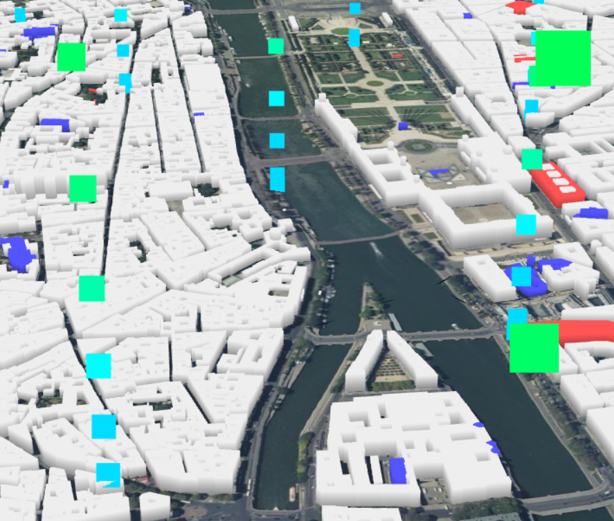
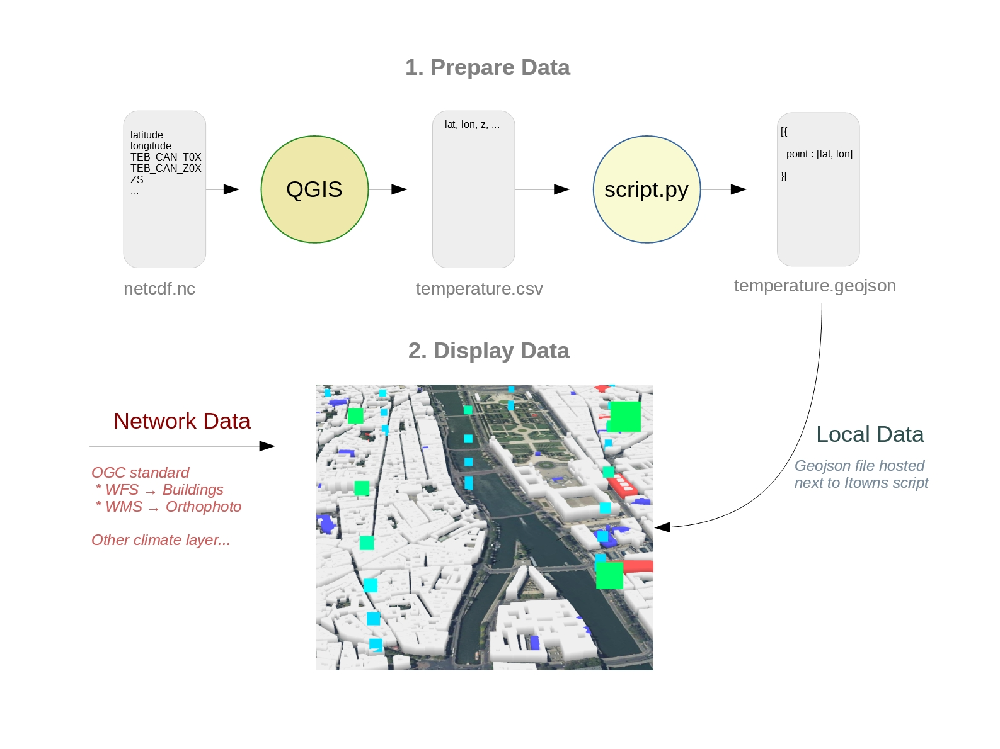

# Web visualization of NetCDF with Itowns

This project proposes a process to generate a 3D co-visualization of NetCDF climatic data with contextual geographical data on the Web. 

In the example, the NetCDF data are the temperature, the contextual geographical data are served by the French geoportal which uses common GI standards, and the 3D visualization client is the open source Itowns technology. A specific feature of the project is to generate intermediate shapes from the climatic data that can rendered together with contextual data. Legible shapes and styles are defined by scientists from the Geovis Team of LaSTIG lab and integrated in this project, little by little. While current code shows the first shapes proposed by Geovis, on-going work focuses on integrating the latest shapes, like for example vertical plans.  We also aim to reproduce this process on different cities, in the context of the URCLIM project.

This is a living project and the logical steps proposed here can evolve to adapt to the community suggestions, for example to integrate NetCDF directly into the client.

## Example

See the example for [Paris](https://cboucheign.github.io/itowns-climate-example/)



> [Source code here](index.html)

## Overview

1. [Export the temperature dataset to a GeoJSON](#extract)
2. [Create your Itowns scene](#itowns)
    * [Source code](index.html) for Paris
    * [Itowns](http://www.itowns-project.org/itowns/docs/#tutorials/Create-a-simple-globe) documentation



<a id="extract"></a>

## Extract NetCDF temperature to GeoJson

### 1.1 CSV using QGIS

In QGIS 3.* (NetCDF Browser peut-être à installer moi j'ai pas eu besoin)

1. Import NetCDF file as Raster and select the following features :
   * latitude (1 feature, 1 channel)
   * longitude (1 feature, 1 channel)
   * TEB_CAN_T0X (6 features, 1 channel)
   * TEB_CAN_Z0X (6 features, 1 channel)
   * THT (1 feature, 32 channels)
   * ZS (1 feature, 1 channel)

2. Create a regular grid layer from raster ZS (or anyone feature)
   * see [QGIS documentation](https://docs.qgis.org/3.16/en/docs/user_manual/processing_algs/qgis/vectorcreation.html#raster-pixels-to-points)

3. Merge attributes from each channel (latitude, longitude, TEB...) to each point
   * using Point Sampling Tool

4. Save the regular grid in CSV. Then load it again using latitude and longitude attributes (WGS:84).

### 1.2 CSV to GeoJSON

Edit the following [script](../data/csv2geoJson.py) with your csv files.

### 1.3 Appendix : compute Meso-NH and TEB height

Calculate the altitude of Meso-NH and TEB levels.

1. Calculate the BASE altitude (POINTS W) of Meso-NH levels using the Galchen formula based on the values of
    * ZS (ground altitude)
    * XZHAT (BASE HEIGHT (POINTS W) meso-NH levels above ground, ZHAT in NetCDF)
    * H (last value of XZHAT)
2. Calculate the altitude of the center of Meso-NH 2 from the altitudes of the W points of Meso NH 2 and 3. The  altitude of the center of meso-NH 2 is identical to the altitude of the center of the TEB 6 level.
3. The Meso-NH 1 level is not to be represented.
4. From the altitude of the center of the Meso-NH 2 level, and the height above the real ground of the TEB levels (TEB_CAN_Z0X in the NetCDF), calculate the altitude of the centers of the different TEB levels.


<a id="itowns"></a>

## Itowns 3D scene

1. Create a new Scene 

```js
// Instanciate PlanarView
view = new itowns.PlanarView(viewerDiv, extent, {
  disableSkirt: true,
  placement: { coord: new itowns.Coordinates('EPSG:2154', 653654.957, 6860967.684), heading: 30, range: 2500, tilt: 60 }
});
view.tileLayer.maxSubdivisionLevel = 18;
view.tileLayer.minSubdivisionLevel = 0;
```

2. Add an elevation Layer

```js
// Adding MNT from Geoportail
const sourceMNT = new itowns.WMSSource({
  url: "https://wxs.ign.fr/3ht7xcw6f7nciopo16etuqp2/geoportail/r/wms",
  version: "1.3.0",
  name: "ELEVATION.ELEVATIONGRIDCOVERAGE.HIGHRES",
  style: "",
  format: "image/x-bil;bits=32",
  crs: 'EPSG:2154',
  extent: extent,
  zoom: { min: 0, max: 14 }
});
const layerMNT = new itowns.ElevationLayer('MNT', { source: sourceMNT });
view.addLayer(layerMNT);
```

3. 1 Add scene layer - orthophoto

```js
const sourceOrtho = new itowns.WMSSource({
  url: "https://wxs.ign.fr/3ht7xcw6f7nciopo16etuqp2/geoportail/r/wms",
  version: "1.3.0",
  name: "HR.ORTHOIMAGERY.ORTHOPHOTOS",
  style: "",
  format: "image/jpeg",
  crs: 'EPSG:2154',
  extent: extent,
  zoom: { min: 0, max: 14 }
});
const layerOrtho = new itowns.ColorLayer('Ortho', { source: sourceOrtho });
view.addLayer(layerOrtho);
```

3. 2 Add scene layer - Buildings

```js
const wfsBuildingSource = new itowns.WFSSource({
  url: 'https://wxs.ign.fr/3ht7xcw6f7nciopo16etuqp2/geoportail/wfs?',
  version: '2.0.0',
  typeName: 'BDTOPO_BDD_WLD_WGS84G:bati_remarquable,BDTOPO_BDD_WLD_WGS84G:bati_indifferencie,BDTOPO_BDD_WLD_WGS84G:bati_industriel',
  crs: 'EPSG:4326',
  ipr: 'IGN',
  format: 'application/json',
  extent: extent
});
const wfsBuildingLayer = new itowns.GeometryLayer('wfsBuilding', new itowns.THREE.Group(), {
  update: itowns.FeatureProcessing.update,
  convert: itowns.Feature2Mesh.convert({
    color: colorBuildings,
    altitude: altitudeBuildings,
    extrude: extrudeBuildings
  }),
  filter: acceptFeature,
  overrideAltitudeInToZero: true,
  source: wfsBuildingSource,
  crs: 'EPSG:2154',
  zoom: { min: 8 }
});
view.addLayer(wfsBuildingLayer);
```

4. Add a temperature layer from NetCDF data.

```js
// Add a geometry layer, which will contain the points to display
const Temperature = new itowns.GeometryLayer('Temperature', new itowns.THREE.Group(),
{
  onMeshCreated: function(mesh) {
    mesh.material.size = 100;
  },
  source: new itowns.FileSource({
    url: 'data/lambert_O_paris_centre.geojson',
    crs: 'EPSG:2154',
    format: 'application/json',
  }),
  crs: 'EPSG:2154',
  update: itowns.FeatureProcessing.update,
  convert: itowns.Feature2Mesh.convert({
    color: function(p) {
      const tempMin = 290;
      const tempMax = 330;
      const Blue = new itowns.THREE.Color("rgb(0, 0, 255)");
      const Red = new itowns.THREE.Color("rgb(255, 0, 0)");
      const alpha = Math.min(255, Math.max(0,(p.temp-tempMin)/(tempMax-tempMin)));
      return Blue.lerpHSL(Red, alpha);
    }
  }),
  zoom: { min: 0 }
});
```

## License

This project is licenced under MIT. Incorporated libraries are published under their original licences.

See LICENSE.md for more information
